# Elasticsearch基本原理

## 一、Elasticsearch定义

​	Elasticsearch 是一个分布式、RESTful 风格的**搜索和数据分析引擎**。	

> ​	Elasticsearch is the **distributed search and analytics engine** at the heart of the Elastic Stack. Logstash and Beats facilitate collecting, aggregating, and enriching your data and storing it in Elasticsearch. Kibana enables you to interactively explore, visualize, and share insights into your data and manage and monitor the stack. Elasticsearch is **where the indexing, search, and analysis magic happens**.

https://www.elastic.co/guide/en/elasticsearch/reference/7.17/elasticsearch-intro.html

​	Elastic Stack, 包括 Elasticsearch、Kibana、Beats 和 Logstash（也称为 ELK Stack）。
能够安全可靠地获取任何来源、任何格式的数据，然后实时地对数据进行搜索、分析和可视
化。Elaticsearch，简称为 ES，ES 是一个开源的高扩展的分布式全文搜索引擎，是整个 Elastic
Stack 技术栈的核心。它可以近乎实时的存储、检索数据；本身扩展性很好，可以扩展到上
百台服务器，处理 **PB 级别**的数据。

​	Elasticsearch内部是将复杂数据序列化为JSON格式来存储的。通过将全文文档分词后，保存为**倒排索引**来进行全文检索。

​	文档的每个字段都被存储为相应的数据结构，text被存储为倒排索引，numeric或geo数据被存储为BKD tree。

​	查询性能的优化需要在以下几方面进行取舍。分片越多，需要维护分片的性能开销就越大。分片越大，查询和rebalance的时间就越长。

> - Aim to keep the average shard size between a few GB and a few tens of GB. For use cases with time-based data, it is common to see shards in the 20GB to 40GB range.
> - Avoid the gazillion shards problem. The number of shards a node can hold is proportional to the available heap space. As a general rule, the number of shards per GB of heap space should be less than 20.

 * 时序索引建议大小为20-40GB

* 每GB堆内存建议少于20个shards，每个节点32G堆内存，意味着每个节点的shard数最好不要超过640.


### 全文搜索引擎


类似于google、baidu、bing之类的搜索引擎。对于海量网页的搜索通常包含如下特点。

* 搜索的数据对象是大量的非结构化的文本数据。
* 文件记录量达到数十万或数百万个甚至更多。
* 支持大量基于交互式文本的查询.
*  需求非常灵活的全文搜索查询。
* 对高度相关的搜索结果的有特殊需求，但是没有可用的关系数据库可以满足。
* 对不同记录类型、非文本数据操作或安全事务处理的需求相对较少的情况。


| -搜索引擎-   | -数据库-   |
| ------------ | ---------- |
| 非结构化数据 | 结构化数据 |
|  查询条件无需精确，不用知道数据结构            |  查询条件必须精确无歧义，必须提前知道数据结构          |
| 会对查询条件进行延伸解释（分词、近义词、联想）  | 不会延伸解释            |


### Elastic Stack生态圈

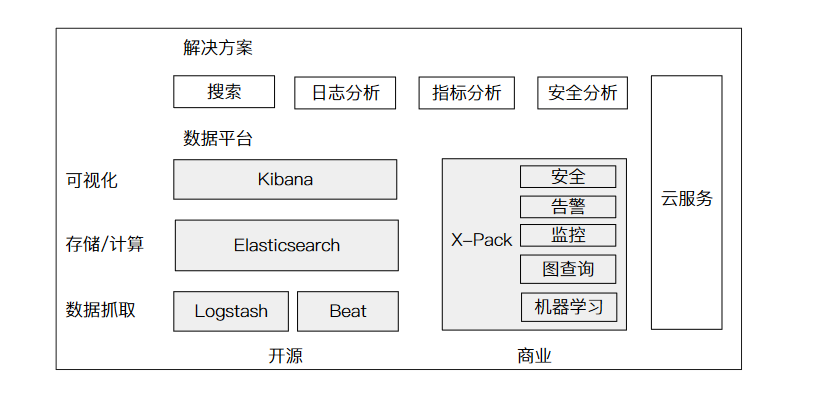

Logstash: 数据采集，类似与flume

Beats：轻量化数据采集器。

Kibana：可视化分析。

X-Pack：商业化套件。


## 二、 部署安装


ES下载地址

下载地址：https://www.elastic.co/cn/downloads/past-releases#elasticsearch

| 目录    | 含义           |
| ------- | -------------- |
| bin     | 可执行脚本目录 |
| config  | 配置目录       |
| jdk     | 内置 JDK 目录  |
| lib     | 类库           |
| logs    | 日志目录       |
| modules | 模块目录       |
| plugins | 插件目录       |

*  5版本的 ES 需要 JDK 版本 8 以上，6.5开始支持Java 11 默认安装包带有 jdk 环境，如果系统配置了JAVA_HOME，那么使用系统默认的 JDK，如果没有配置使用自带的 JDK。


## 三、 基本概念


### 倒排索引

#### 正排----目录

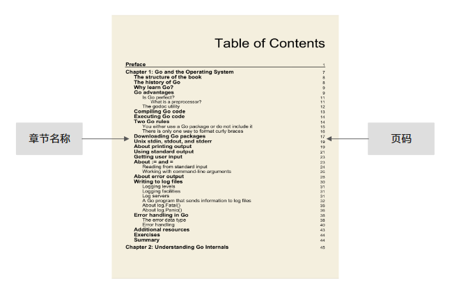

使用mysql进行存储之后的表结构如下

| title                       | page_num | content                                |
| --------------------------- | -------- | -------------------------------------- |
| Go and the Operating System | 7        | Go is a good programing language...... |
| The Structure of the book   | 8        | ....                                   |

如果想查找内容中的某个词，比如‘programing’。只能用语句

select * from table where content like '\*programing\*'；

会导致索引内容巨大，查询速度极慢

./pics/BM25.png

#### 倒排 - 索引页

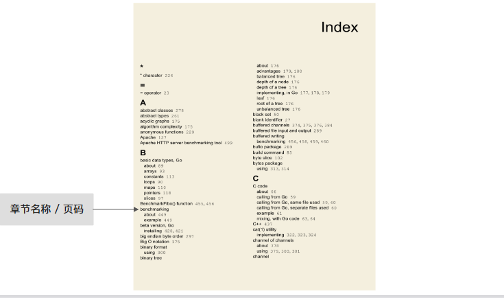


倒排索引，可以直接查询词programing在哪一页。


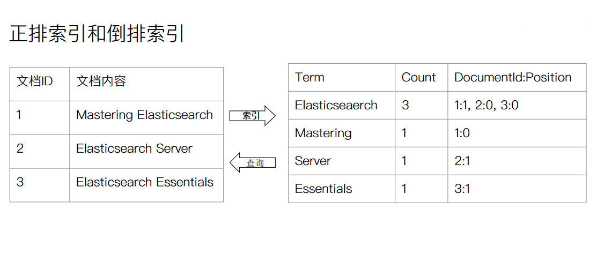

### Elasticsearch 中的倒排索引

* ES中的倒排索引包含两个部分
  * 单词词典（Term Dictionady），记录所有文档的单词，记录单词到倒排列表的关联关系。
    * 单词词典一般比较大，通过B+树或者哈希拉链法实现。
  * 倒排列表（Posting List），记录单词对应的文档结合，由倒排索引项组成。
    * 倒排索引项包含
      * 文档ID
      * 词频TF - 该单词在文档中出现的次数，用于相关性评分
      * 位置（Position）- 单词在文档中分词的位置。用于语句搜索（phrase query）
      * 偏移（Offset）- 记录单词的开始结束位置，实现高亮显示

例子：

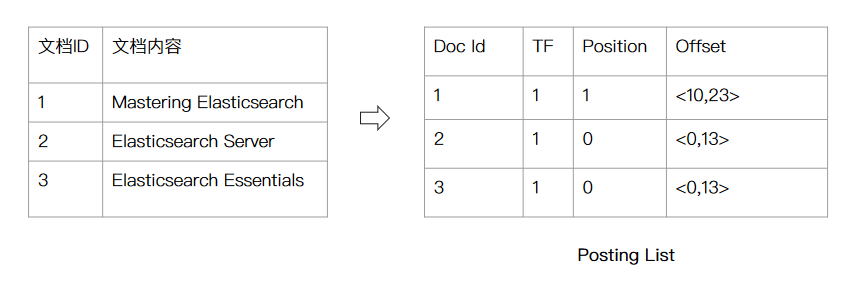

### BKD Tree

ES中的其他数据结构是通过BKD树来索引的

https://medium.com/swlh/bkd-trees-used-in-elasticsearch-40e8afd2a1a4#:~:text=BST%20or%20other%20similar%20implementations,the%20tree%20with%20the%20pivot.


BST平衡二叉树是用来查找一维数组的数据结构

BKD树是用来查找多维数组的数据结构

BKD树中引用了一个discriminator 的概念，公式如下
$$
discriminator = level \% N 
$$
where level is the level of the tree and N is the number of dimensions


### Elasticsearch 中的基本概念

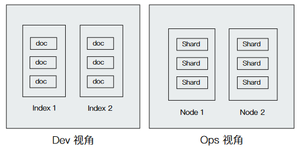

#### 数据模型

* Index 索引
  * Type 类型（废弃， 7.0之后统一为_doc）
    * Doc文档

##### 文档 Doc

* 文档是所有可搜索数据的最小单位，相当于RDBMS中的一条数据
* 文档的保存格式是JSON，每个字段都有对应的字段类型。
* 在一个index中，每个文档都有一个Unique ID，可以指定，也可以自动生成。


一个文档包含属下元数据：

* 元数据，用于标注文档的相关信息
  * _index - 文档所属的索引名
  * _type - 类型名，7.0被统一为 _doc
  * _id - 文档唯一 ID
  * _source - 文档的原始Json数据
  * _all - 整合所有的字段到该字段，7.0被废除
  * _version: 文档的版本信息
  * _score: 相关性打分


#### 程序架构

* Cluster 集群
  * Node 节点
    * Shard分片


##### 集群 Cluster

* 高可用性
  * 服务可用性---部分节点丢失，不会停止服务，不会丢失数据。
* 可扩展性
  * 随着请求量的提升、数据的不断增长，可以将数据分布到所有节点上。
* 不同的集群通过不同的集群名(clusterName)来区分

集群的健康状态：

* Green -- 主分片与副本分片都正常分配
* Yellow -- 主分片全部正常分配，有副本分片未能正常分配
* Red -- 有主分片未能分配

##### 节点 Node

* 一个节点本质上是一个JAVA进程
* 每个节点都有一个名字，通过文件配置，或启动时指定
* 每个节点启动后，都会分配一个UID，保存在data目录下

一个节点可以分为以下**角色**：

###### Master

* 可以参加选主流程，成为Master节点
* 每个节点都保存了集群的状态，只有Master节点才能修改集群的状态信息
  * 集群状态（Cluster State），维护了一个集群中的必要信息
    * 所有的节点信息
    * 所有的索引和相关的Mapping与Setting信息
    * 分片的路由信息

###### Data Node

可以保存数据的节点，负责保存分片数据。

###### Coordinating Node

* 负责接受Client的请求，并将请求分发到合适的节点。
* **负责汇聚每个节点返回的结果，并计算出最终结果，返回给Client。**
* 每个节点默认都可以作为Coordinating Node

###### Hot & Warm Node

通过配置不同硬件的Data Node来实现Hot & Warm架构。

5.0时通过配置节点属性来进行配置，7.0直接可以作为node.role：[] 的配置项来进行配置。

###### Machine Learning Node

负责跑机器学习Job的节点，X-pack中的收费项目

###### Tribe Node

作为连接不同ES集群的节点

###### Ingest Node

ingest 节点可以看作是数据前置处理转换的节点，支持 pipeline管道 设置，可以使用 ingest 对数据进行过滤、转换等操作，类似于 logstash 中 filter 的作用


##### 分片

* 主分片，用以解决数据水平扩展的问题。通过主分片，可以将数据分布到集群内的所有数据节点上。

  * 一个分片是一个运行的Lucene的实例
  * 主分片数在索引创建时指定，后序不可以修改。

* 副本分片， 用于解决数据高可用问题。分片时主分片的拷贝。

  * 副本分片数可以动态调整，为主分片的整数倍。
  * 增加副本数，可以在一定程度上提高服务的可用性。

  

  

## 四、分布式特性


### 集群选主

集群启动过程指集群完全重启时的启动过程，期间要经历选举主节点、主分片、数据恢复等重要阶段。

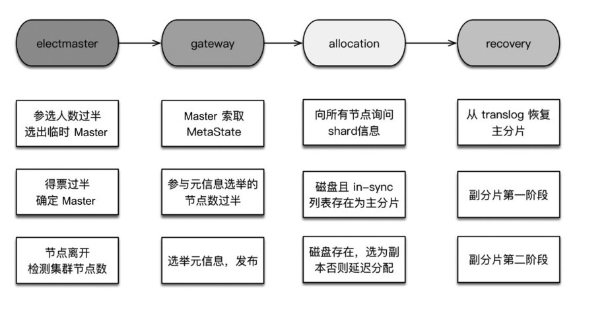

集群启动的第一件事是从已知的活跃机器列表中选择一个作为主节点，选主之后的流程由主节点触发。ES的选主算法时基于Bully算法的改进。主要思路是对节点ID排序，取ID值最大的节点作为Master。简单来说，在bully算法中，每个节点都有一个编号，只有编号最大的存活节点才能成为Master节点。

#### Bully算法简介

[Bully算法简介] https://www.cs.colostate.edu/~cs551/CourseNotes/Synchronization/BullyExample.html

[ES 选举算法简介] https://zhuanlan.zhihu.com/p/110015509

[ES集群发现机制] https://zhuanlan.zhihu.com/p/109570606

假设有如下6节点组成的集群，每个节点都会维护和其它节点的联系，p6节点是当前集群的master节点

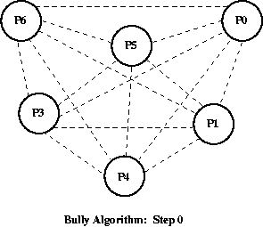

某个时间，master节点P6发生了宕机。

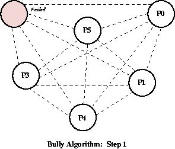

P3节点是整个集群中最先发现master节点宕机的节点，p3节点通知了比自己编号大的p4，p5节点，p6节点

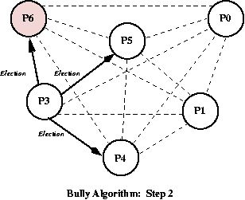


因为p6节点已经宕机，只有p4，p5节点向p3节点发出响应，并通知p3节点他们会取代p6节点成为master节点

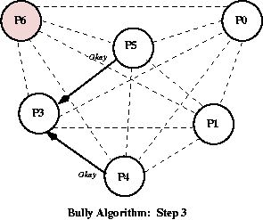


P4节点向P5，P6节点发送通知

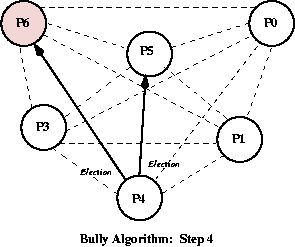

因为p6节点已经宕机，所以只有p5节点作出了响应

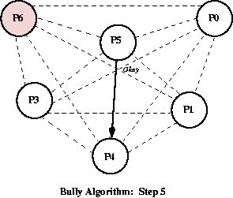


P5节点向P6节点发起选举通知，P6节点没有响应，于是P5节点成为了整个集群的master节点

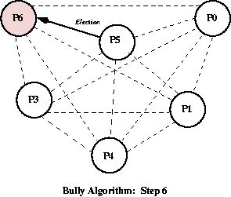

P5节点成为了整个集群的master节点

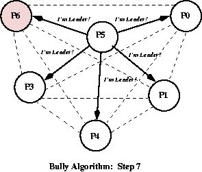


#### Elasticsearch 编号介绍

​	Elasticsearch编号比较的判断依据有两个，首先是ClusterState版本号的比较，版本号越大优先级越高，然后是节点id的比较，id越小优先级越高。ClusterState是Master向集群中各个节点发送的集群状态，这个状态有一个版本号码，如果集群状态发生了变化，比如集群新增了节点成员或者有节点成员退出了，那么这个版本号就会加一，比对这个版本号的目的是让拥有最新状态的节点成为Master的优先级最高。


#### Master 假死

Master节点承担的职责负载过重的情况下，可能无法即时对组内成员作出响应，这种便是假死。如果上图中的P6节点假死，于是P5节点成为了Master节点，但是在P6节点负载减轻之后，P6节点又对组内成员作出了响应，P6节点又会成为Master节点，如此反复，整个集群状态就会非常不可靠。

Elasticsearch是如何解决这个问题的呢？在Bully算法中，Master节点P6因为负载重，来不及对P3节点作出响应，所以P3节点通知P4,P5节点进行选举。在Elasticsearch中，P3节点发现Master P6对自己长时间不作出响应，P3节点会请求其它节点判断P6节点是否存活，如果有1/2以上节点都认定P6存活，那么P3就会放弃发起选举


#### 脑裂问题

当一个集群因为网络问题，分裂成了两个集群，选出了两个Master。导致网络恢复时，无法正确恢复集群。

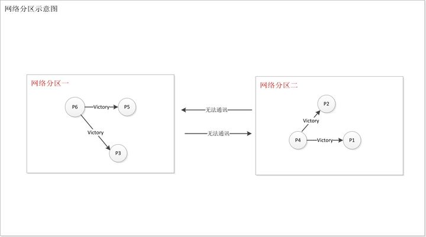


**如何避免脑裂**

限定一个选举条件，设置quorum(多数仲裁)，只有在 Master Eligible节点数大于quorum时，才能进行选举。

* quorum = master eligible nodes / 2 + 1
* 当 master eligible nodes = 3， 设置discovery.zen.minimum_master_nodes为2，即可避免脑裂

从7.0开始，无需配置该参数。

​	如果产生了脑裂情况，为了避免脑裂的Master生成错误数据对整个集群产生影响。Master更新集群状态时还作出了如下防护，Master有两种指令，一种是send指令，另一种是commit指令，Master将最新集群状态推送给其它节点的时候(这是send指令)，Master节点进入等待响应状态，其它节点并不会立刻应用该集群状态，而是首先会响应Master节点表示它已经收到集群状态更新，同时等待Master节点的commit指令。

​	Master节点如果在discovery.zen.commit_timeout配置时间内都没有收到discovery.zen.minimum_master_nodes个数的节点响应，那么Master节点就不会向其它节点发送commit指令。如果Master收到了足够数量的响应，那么Master会向集群发出提交状态的指令commit，此时其它节点应用集群最新状态，Master节点再次等待所有节点响应，等待时间为discovery.zen.publish_timeout，如果任何一个节点没有发出提交响应，Master再次更新整个集群状态更新。

 

### 文档分布式存储

如何计算doc会具体存储在哪个分片上？数据分布方式是什么

* 文档到分片的映射算法
  * 确保文档能均匀分布到所有分片上，充份利用硬件资源，避免部分机器空闲，部分机器繁忙
  * 数据分布算法
    * 随机/Round Robin。优点：平均；缺点：查询效率地
    * 维护文档到分片的映射关系。优点：查询效率高；缺点：数据量大时，维护成本高
    * 实时计算，通过数据自动算出到哪个分片去获取文档。


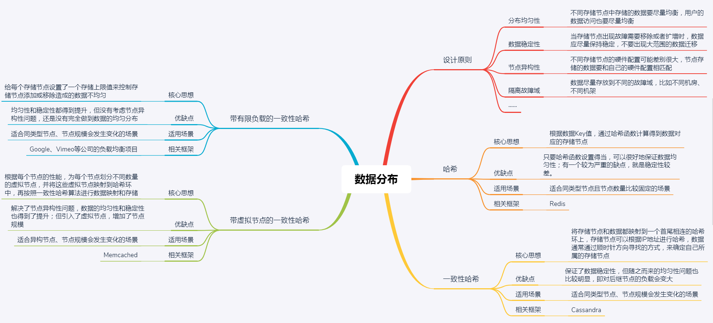


**ES中的文档到分片路由算法**
$$
shard = hash(\_routing) \quad \% \quad number\_of\_primary\_shards
$$

* Hash算法确保文档均匀分散到分片中
* 默认的_routing值是文档id
* 可以自行指定_routing数值，例如某个网站的数据，都分配到指定的shard
* 设置 Index Setting后， primary参数不能随意修改的**原因**


#### 分片shard及其生命周期

分片是ES中的最小工作单元, 是一个完整的Lucene的Index

* ES是如何实现近实时搜索的（1秒后被搜到）

* ES如何保证在断电时数据也不会丢失

* 为什么删除文档，并不会立刻释放空间


##### Lucene Index

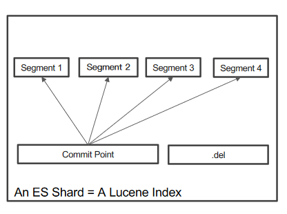

* 在Lucene中，单个倒排索引文件被成为Segment。Segment是自包含的，不可变更的。多个Segments汇总在一起，称为Lucene的Index，对应ES就是Shard
* 有新文档写入时，会生成新的Segment，查询时会同时查询所有的Segments，并对结果汇总。Lucene中有一个文件，用来记录Segments的信息，叫做Commit Point
* 删除的文档信息，保存在“.del”文件中，查询的时候，会根据".del"文件对结果做一次过滤。

##### 什么是Refresh

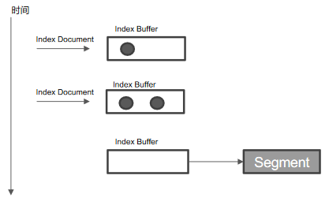

* 在写数据的时候，先会将数据写入Index Buffer（内存）。一定频率（index.refres_interval）写入segment文件中去。将Index Buffer写入Segment（os cache）的过程叫**Refresh**。Refresh不执行fsync操作。
* index.refres_interval默认是1秒。Refresh之后就可以被搜索到了。这就是ES被称作近实时搜索的原因
* 如果系统有大量数据写入，就会产生很多Segment
* Index Buffer 被占满时也会触发Refresh，默认时JVM堆内存的10%


##### 什么是Transaction Log

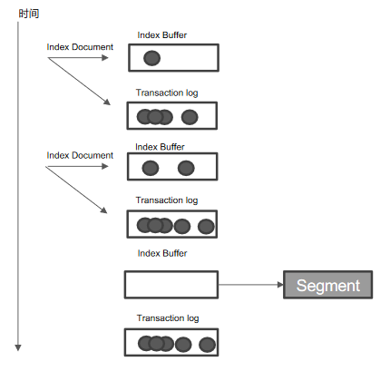


* Segment写入磁盘的过程相对耗时，借助os cache，refresh时先将Segment写入缓存以开放查询
* 为了保证数据不丢失。所以在做doc索引时，同时写入Transaction Log。Transaction Log默认每隔5s或者在一个变更请求之后刷入磁盘。可以通过减小Transaction Log的刷盘频率来保障数据的可靠性，但是性能影响较大。
* 在ES Refresh时，Index Buffer被清空，Transaction Log不会清空。


##### 什么是Flush

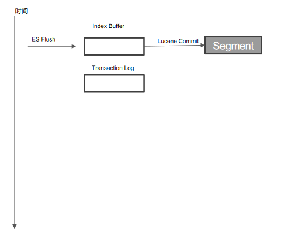

* ES Flush & Lucene Commit
  * 调用Refresh， Index Buffer清空并且Refresh
  * 调用fsync，将缓存中的Segments写入磁盘
  * 更新commit point
  * 清空（删除）Transaction Log
  * 默认30分钟调用一次
  * Transaction Log满了会调用一次（默认512 MB）


##### 什么是Merge

* 合并多个Segment文件为一个
* 根据".del"文件真正删除doc
* ES和Lucene会自动进行Merge
  * POST {index_name}/_forcemerge

​	merge操作比较重，一般非必须不建议手动改执行。从hot节点移动到warm节点时，建议执行一次。


## 五、搜索、聚合


### 分布式查询

#### 分布式搜索的运行机制

* ES 搜索会分量阶段进行
  * 第一阶段 -- Query
  * 第二阶段 -- Fetch


##### Query阶段

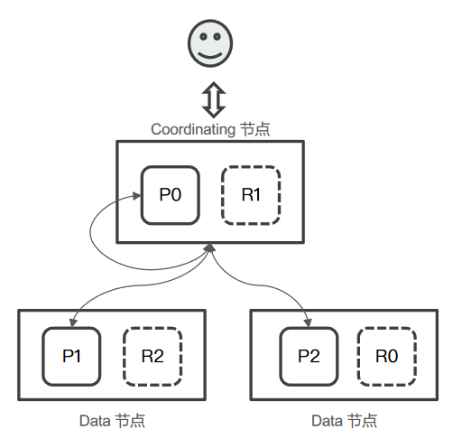


* 用户发出搜索请求到ES节点。节点收到请求后，会以Coordinating节点的身份，在6个主副分片中，随机选择3个分片，发送查询请求。
* 被选中的分片执行查询，进行排序。然后，每个分片都会返回From + Size个排序后的文档ID和排序值给Coordinating节点


###### Fetch 阶段

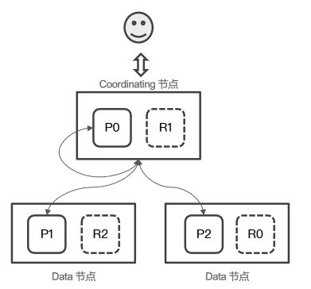

* Coordinating节点会将Query阶段从每个分片获取的doc id列表，重新进行排序。选取From + Size个文档Id
* 以multi get请求的方式，到相应的分片获取详细的文档数据（https://www.elastic.co/guide/en/elasticsearch/reference/current/docs-multi-get.html）


#### Query then Fetch 潜在的问题

* 性能问题
  * 每个分片上需要查询的文档个数 = from + size
  * 最终协调节点需要处理 ： number_of_shard * (from + size)
  * 深度分页
* 相关性算分的问题
  * 每个分片都基于自己的分片上的数据进行相关度计算。会导致打分偏离的情况，特别是数据量很少时。相关性算分在分片之间相互独立。当文档总数很少的情况下，主分片越多，相关性算分会越不准
* 解决相关性算分不准的方式
  * 数据量不大时，将主分片数设置为1
  * _search?search_type=dfs_query_then_fetch
    * 等同于到每个分片把各分片的词频和文档频率进行搜集，然后进行一次完整的相关性算分。耗费更多的CPU和内存，执行效率低下，一般不建议使用。


### 搜索的相关性算分

* 搜索的相关性算分描述了一个**文档**和**查询语句**的匹配程度。ES会对每个匹配查询条件的结果进行算分。

* 打分的本质是排序，把最符合用户需求的文档排在最前面。

* ES 5之前是TF-IDF， 5之后开始采用BM25

#### 查询样例


#### 词频

* 词频TF（Term Frequency）: 检索词在一篇文章中出现的频率
* 度量一条查询和结果文档相关性的方法：简单的将查询语句中的每一个词的TF进行相加
  * TF(区块链) + TF(的) + TF(应用)
* 停用词Stop Word
  * “的”虽然出现的次数很多，但是对查询的相关性几乎没有用处，所以应该排除在外


#### 逆文档频率 IDF

* DF ： 检索词在所有文档中出现的频率
  * “区块链”在相对较少的文档中刚出现
  * “应用”在相对比较多的文档中出现
  * “的”在大量的文档中出现
* Inverse Document Frequency（IDF） = log（全部文档数/ 检索词出现的文档数）
  * 检索词出现的文档数越小，IDF越大，表示查出来的doc可能和查询语句的相关性越高
* TF-IDF本质上就是将TF 求和变成了**加权求和**
  * TF（区块链） * IDF（区块链） + TF（的） * IDF（的） + TF（应用） * IDF（应用）

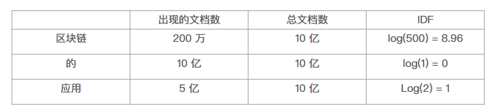


#### Lucence中的 TF-IDF 评分公式

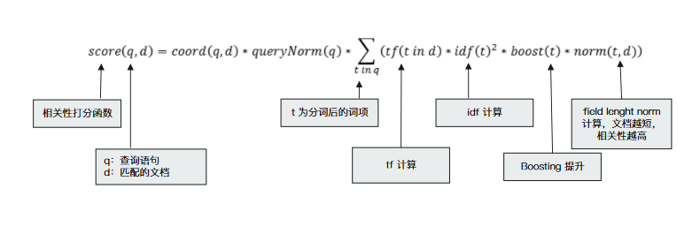


#### BM25

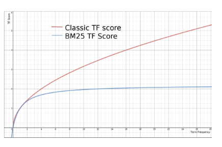

* 从ES 5开始，默认算法变为BM25
* 和经典的TF-IDF相比，当TF无限增加时，BM25算分会趋于一个数值


BM25详细解释：

https://www.cnblogs.com/novwind/p/15177871.html


* ES中可以通过explain参数查看算分过程
* 还可以通过boosting参数控制相关的算分结果

Bool查询时：

Query Context：需要算分

Filter Context：不需要算分

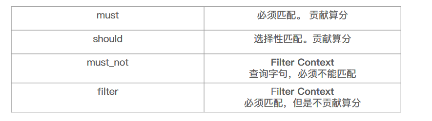


### 聚合分析

#### 什么是聚合（Aggregation）


**聚合**是针对ES中的数据，进行统计分析的功能。

**聚合的分类**

* Bucket Aggregation - 满足特定条件的文档的集合
* Metric Aggregation - 通过计算一些指标，对文档字段及逆行统计分析
* Pipeline Aggregation - 对其他的聚合结果进行二次聚合
* Matrix Aggregation - 支持多字段操作，并提供一个结果矩阵


#### Bucket 和 Metric

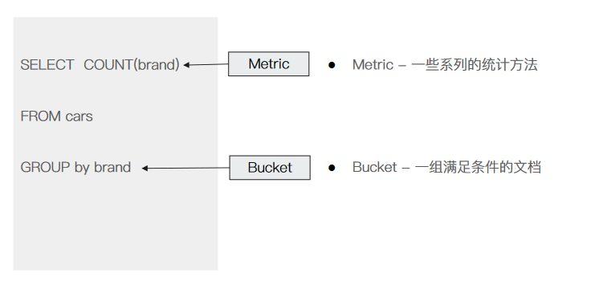

##### Bucket

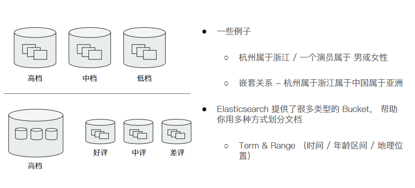


##### Metric


## 六、集群扩展和运维

### 常见的集群部署方式

* 节点不同角色
  * Master eligible / Data / Ingest / Coordinating / Machine Learning
* 生产环境中
  * 根据数据量，写入和查询的吞吐量，选择合适的部署方式
  * 建议设置单一角色节点

一个节点在默认情况下会同时扮演：master eligible, data node 和 ingest node

| 节点类型          | 配置参数    | 默认值                      |
| ----------------- | ----------- | --------------------------- |
| master eligible   | node.master | true                        |
| data              | node.data   | true                        |
| ingest            | node.ingest | true                        |
| coordinating only | 无          | 以上三个参数全部设置为false |
| machine learning  | node.ml     | true（需要 x-pack enable）  |


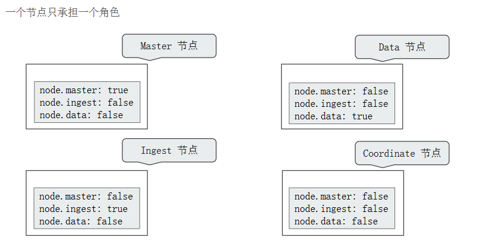


配置建议：

* master eligible nodes: 负责集群状态（cluster state）的管理
  * 使用低配置的CPU, RAM和磁盘
* data nodes: 负责存储数据和客户端的读写请求
  * 使用高配置的CPU, RAM 和磁盘（SSD）
* ingest node: 负责数据处理
  * 使用高配置CPU， 中等配置RAM，低配置磁盘
* coordinating only node（Client node）：负载均衡
  * 中高配CPU, 高配RAM， 低磁盘


**单一职责 Master Node**

* 高可用，避免脑裂
  * 一般生产环境配置3台
  * 一个集群只有1台活跃的主节点
    * 负责分片管理，创建索引，集群管理
* 如果和data node或者 coordinating node混部
  * data node相对占用内存较大
  * coordinating node有时开销比较高，导致OOM
  * 影响到master节点会导致集群不稳定


**单一职责 Cooridnating Node**

* 扮演Load Balancers。降低Master和Data Nodes的负载
* 负责搜索结果的 Gather 和 Raduce
* 在无法预知客户端发送什么样的请求的情况下，宕机不会影响到集群
  * 大量占用内存的聚合操作，深度聚合可能会引发OOM
  * 频繁bulk操作，未完成的大请求会保存在heap中，无法GC，造成OOM。


#### 基本部署

* 当磁盘容量无法满足需求时，可以增加数据节点
* 磁盘读写压力大时，增加数据节点

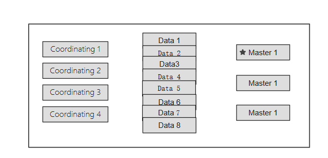

#### 水平扩展

* 当系统中有大量负责聚合及聚合时，增加Coordinating节点，增加查询性能

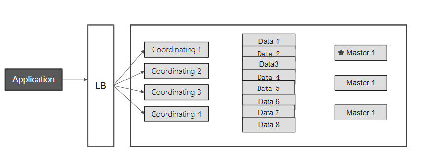


* 也可以将Coordinating节点划分为读写分离

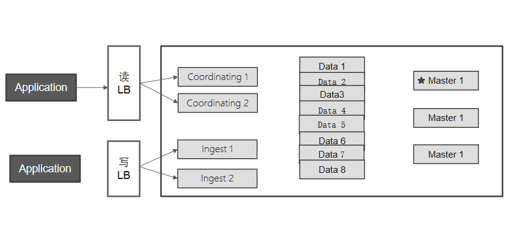

* kibana通常部署在coordinating节点

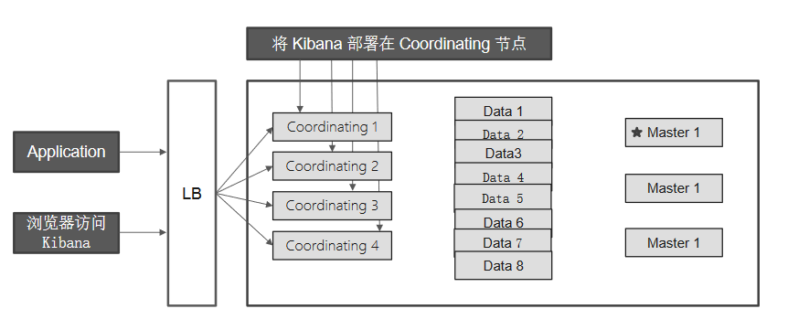


#### 异地多活部署

集群分别在三个数据中心， GTM（Global Traffic Manager）分发读写请求


### Hot & Warm 架构与 Shard Filtering

* 针对数据节点进行的架构设计
* 数据通常不会有update操作，适用于Time based索引数据，同时数据量比较大
* 引入warm节点，低配置大容量的机器存放老数据，以降低部署成本
* 两类数据节点，不同硬件配置
  * Hot节点（通常使用SSD）: 索引不断有新文档写入。通常使用SSD
  * Warm节点 （通常使用HDD） ： 索引不存在新数据写入。同时也不存在大量的数据查询


**配置Hot & Warm架构**

使用Shard Filtering，步骤分为以下几步：

1. 标记节点（Tagging）；
2. 配置索引到Hot Node（标记索引）；
3. 配置索引到Warm Node（标记索引）；


#### 标记节点

* 通过node.attr属性来标记节点
  * 节点的attr可以是任何的值
  * 可以通过elasticsearch.yml或者 -E 命令来指定
  * 无法动态配置，需要重启节点才能生效
  * 可以通过`GET /_cat/nodeattrs/?v`命令来查看节点属性


#### 标记索引

* 创建索引时，指定将其创建在hot节点上

  ```  shell
  PUT traceIndex-2022-01-25
  {
  	"settings" : {
  		"number_of_shards" : 1,
  		"index.routing.allocation.require.my_node_type" : "hot"
  	}
  }
  ```

  

* 旧数据移动到warm节点

```shell
PUT traceIndex-2022-01-25/_seettings
{
	"index.routing.allocation.require.my_node_type": "warm"
}
```


 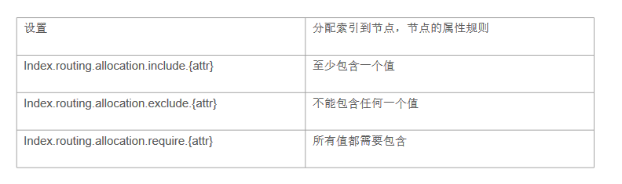


### 生产环境常用配置与上线清单

Development VS. Production Mode

* 从ES 5 开始，支持Development 和 Production 两种运行模式

  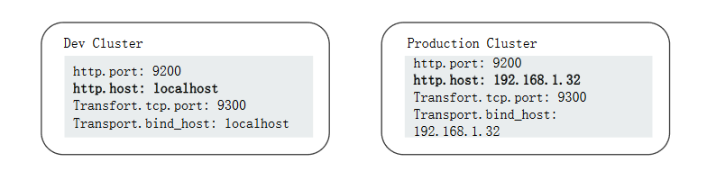


**Bootstrap Check**

* 集群在Production Mode时，启动必须通过所有的Bootstrap 检测， 否则就会启动失败
* Bootstrap Checks可以分为两类
  * JVM
  * Linux Checks

**JVM 设定**

* 从ES6 开始， 只支持64位JVM
* 避免修改默认配置
  * 将内存Xms和Xmx设置成一样，避免heap resize时引发停顿
  * Xmx设置不要超过物理内存的50%；单个节点上，最大内存建议不要超过32G内存
  * 生产环境，JVM必须使用Server模式
  * 关闭JVM Swapping

**集群的参数设定**

* 静态设置和动态设定
  * 静态配置文件尽量只配置**必要参数**
  * 其他的设置可以通过API动态设定。动态设定分为transient和persistent两种，都会覆盖elasticsearch.yml中的设置
    * Transient 在集群重启后会丢失
    * Persisten 在集群重启后不会丢失
* 优先级
  * Transient Settings
  * Persistent Settings
  * Command-line Settings
  * Config File Settinrgs


**系统必要配置**

https://www.elastic.co/guide/en/elasticsearch/reference/7.16/system-config.html


**关闭动态索引**

* 考虑关闭动态索引创建功能

``` shell
PUT _cluster/settings
{
	"persistent":{
		"action.auto_create_index" : false
	}
}
```


* 通过模板设置白名单

``` shell
PUT _cluster/settings
{
	"persistent" : {
		"action.auto_create_index" : "logstash-*, .kibana*
	}
}
```


**集群安全设定**

* 为ES  和 Kibana配置安全功能
  * 打开Authentication & Authorization
  * 实现索引和字段级别的安全控制
* 节点间加密通信----TLS
* Enable HTTPS
* Audit logs


### 监控 Elasticsearch 集群

Elasticsearch Stats 相关API

```shell
#节点相关信息统计
GET _node/stats?

# 集群
GET _cluster/stats?

#索引
GET index_name/stats?

```


Elasticsearch Task 相关API

```
#当前执行的任务
GET _cluster/pending_tasks?

#查看所有task，可以用来cancel一个task
GET _tasks？

#线程池相关
GET _nodes/thread_pool?

GET _nodes/stats/thread_pool?

GET _cat/thread_pool?v

GET _nodes/hot_threads?


```


Elasticsearch Health 相关API

```shell
#集群状态检查
GET _cluster/health?

#所有索引的健康状态（查看有问题的索引）
GET _cluster/health?level=indices

#单个索引的健康状态
GET _cluster/health/my_indes

#分片级别的状态
GET _cluster/health?level=shards

#返回第一个未分配shard的原因
GET _cluster/allocation/explain
```


阿里云EYou

https://developer.aliyun.com/article/657712


